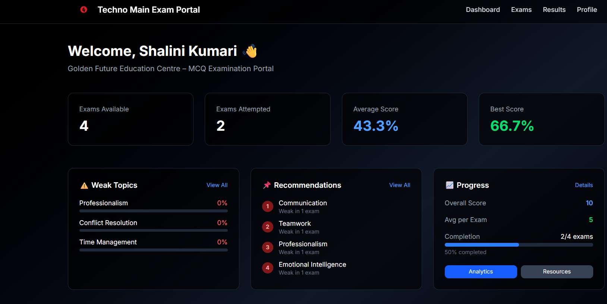
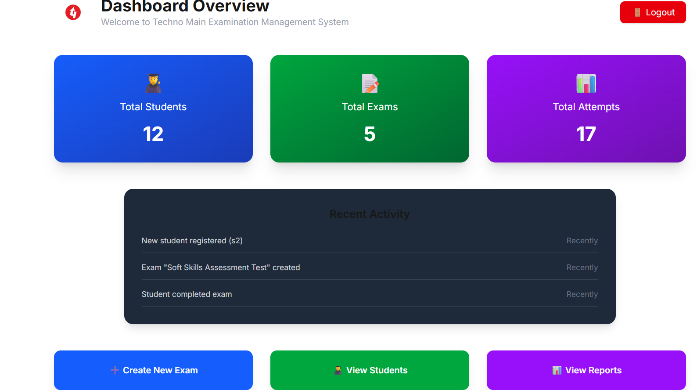
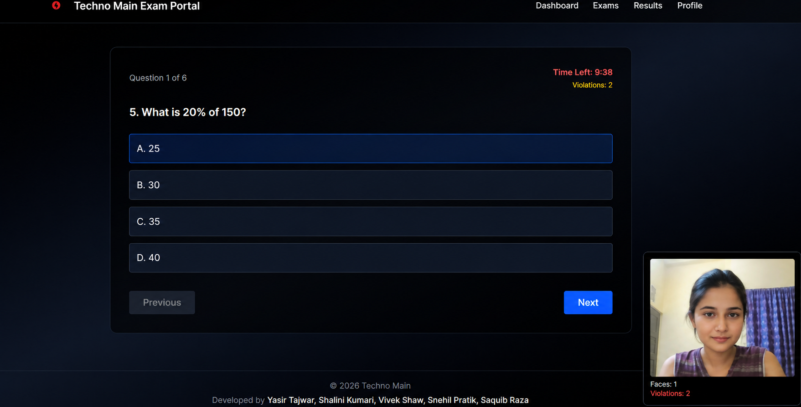
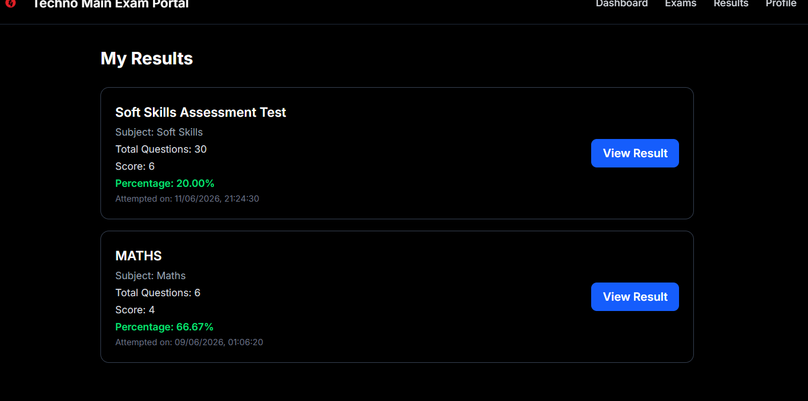

# Smart Exam Learning Management System
## Overview

The Smart Exam Learning Management System is a web-based platform that streamlines the process of conducting online examinations and managing student learning activities. The system provides a secure and efficient environment for students to take exams while enabling administrators to create, manage, and monitor examinations with ease.

A key feature of the platform is its AI-based face detection module, which helps ensure examination integrity by monitoring students during online tests. The system automatically evaluates responses, generates results, and provides performance insights, reducing manual effort and improving accuracy.

With dedicated dashboards for students and administrators, the platform offers a user-friendly experience, secure authentication, real-time monitoring, and automated result processing, making it a reliable solution for modern digital examinations and learning management.

## Key Features

* Secure User Authentication
* Student Registration and Login
* Admin Dashboard for Exam Management
* Student Dashboard for Exam Participation
* Online Examination System
* AI-Based Face Detection Monitoring
* Automatic Result Generation
* Performance Tracking and Analysis
* Responsive and User-Friendly Interface

## Technologies Used

* Next.js
* React.js
* JavaScript
* HTML5
* CSS3
* MongoDB
* AI Face Detection
* Git & GitHub

## System Workflow

1. User Registration and Login
2. Exam Creation by Admin
3. Student Exam Participation
4. AI-Based Face Monitoring
5. Answer Submission
6. Automatic Evaluation
7. Result Generation and Analysis

## Project Screenshots

### Student Dashboard



### Admin Dashboard



### Face Detection Monitoring



### Result Generation



## Modules

### Admin Module

* Manage Students
* Create and Manage Exams
* Add and Update Questions
* Monitor Examination Activities
* View Results and Reports

### Student Module

* Register and Login
* Access Available Exams
* Attempt Online Tests
* View Results and Performance

### AI Monitoring Module

* Real-Time Face Detection
* Student Verification
* Enhanced Exam Security
* Continuous Monitoring During Exams

## Advantages

* Secure Examination Environment
* Reduced Manual Effort
* Automated Result Processing
* Real-Time Monitoring
* Improved Accuracy
* Better Learning Experience

## Future Scope

* Eye Tracking System
* Voice Monitoring
* Tab Switching Detection
* Mobile Application Support
* Advanced AI Proctoring
* Detailed Performance Analytics

<<<<<<< HEAD
This is a [Next.js](https://nextjs.org) project bootstrapped with [`create-next-app`](https://nextjs.org/docs/app/api-reference/cli/create-next-app).

## Getting Started

First, run the development server:

```bash
npm run dev
# or
yarn dev
# or
pnpm dev
# or
bun dev
```

Open [http://localhost:3000](http://localhost:3000) with your browser to see the result.

You can start editing the page by modifying `app/page.tsx`. The page auto-updates as you edit the file.

This project uses [`next/font`](https://nextjs.org/docs/app/building-your-application/optimizing/fonts) to automatically optimize and load [Geist](https://vercel.com/font), a new font family for Vercel.

## Learn More

To learn more about Next.js, take a look at the following resources:

- [Next.js Documentation](https://nextjs.org/docs) - learn about Next.js features and API.
- [Learn Next.js](https://nextjs.org/learn) - an interactive Next.js tutorial.

You can check out [the Next.js GitHub repository](https://github.com/vercel/next.js) - your feedback and contributions are welcome!

## Author

**Shalini Kumari**

Developed as an academic project to provide a secure and intelligent online examination and learning management platform.
